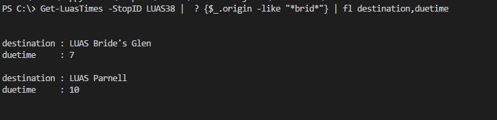
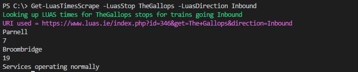

# LUAS_Powershell
A set of two Powershell commands to access LUAS times with two different methods. You get different data back from each

# Get-LuasTimes 
Get-LuasTimes makes a REST call to https://data.dublinked.ie where you can lookup any bus, LUAS or Stop stop. 
For some reason 14/1/2018 the new LUAS stops do not show up yet 

# Get-LuasTimesScrape 
Get-LuasTimesScrape makes a web call to the same URL The Luas.ie calls when you look at the web page
In addition to times you also get an error data that would be displayed on the page, Like where an elevator is out

